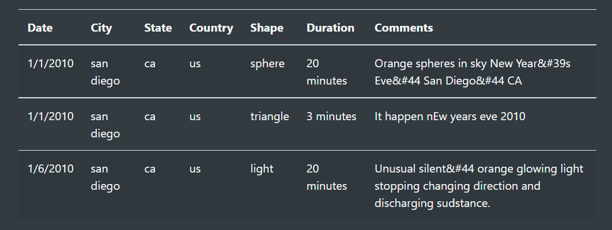

# Overview of Project: 
## Explain the purpose of this analysis.
  
  The purpose of this analysis is to create a webpage and dynamic table to provide a more in-depth insight on UFO sightings by allowing users to filter for multiple criteria at  
  the same time. In addition to the date, the table filters for the city, state, country, and shape.

# Results: 
## Describe to Dana how someone might use the new webpage by walking her through the process of using the search criteria. Use images of your webpage during the filtering process to support your explanation.
  
  
  
  Users can filter through specific city, state, country, and shape to gain more insight on UFO sightings allowing more in dept analysis on occurences. 
  
  ## How the javascript work: 
  The app.js will find the corresponding results and return the data to the table. 
  
  For example, filter the city with San Diego will return 3 sightings in 2010 all occuring in January lasting for a max of 20 minuites.  

# Summary: 
## In a summary statement, describe one drawback of this new design and two recommendations for further development.
  One drawback is being able to visual the data in a graph. 
  
  This design can benifit from graphs to visual the data and the option to import and export new data to further analysis with data. 
